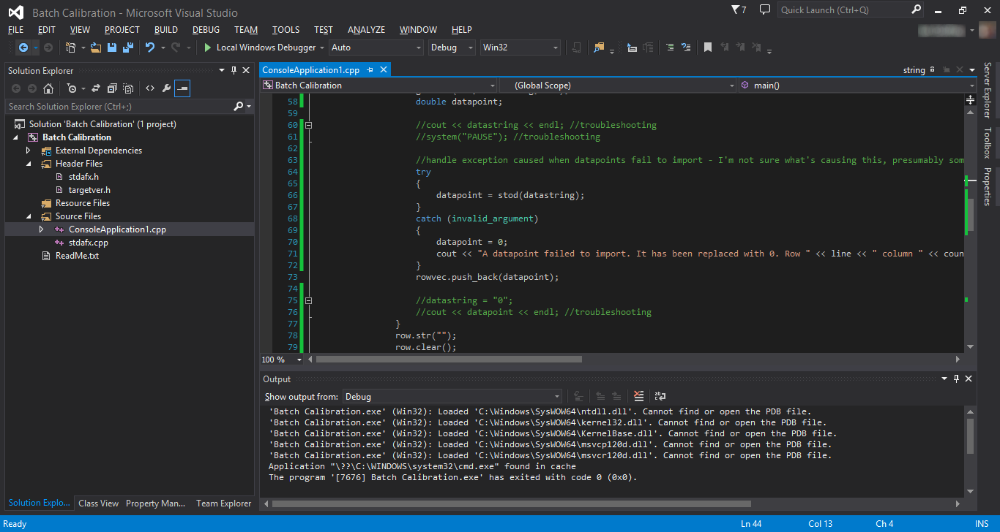

# Les IDEs

### Sommaire

**En cours d'écriture**

## Qu'est-ce qu'un IDE ?

Un *Integrated Development Environment* (**IDE**), *EDI* en français, est un ensemble d'outils utilisé pour le développement d'une application, généralement proposé sous la forme d'un logiciel.

Les outils proposés sont variables, on retrouve souvent un éditeur de texte, un compilateur, des outils d'automatisation de compilation et de génération d'exécutable (build automation), un debugger...

Parfois, ces outils peuvent être interchangés. Par exemple, les IDEs C++ proposent souvent de modifier le compilateur utilisé.

Beaucoup d'IDE sont disponibles pour le C++, parmi lesquels  *CLion*, *Code::Block*, *KDevelop*, *Eclipse*, *Netbeans*, *QtCreator*, *Visual Studio*, *XCode*...

Il est tout à fait possible de se passer d'un IDE et de se contenter d'un "simple" éditeur de texte (vim, Emacs, Sublim Text, Atom, Visual Code, Notepad++ etc...). Il est alors nécessaire d'utiliser séparément les différents outils habituellement inclus dans l'IDE.

## Quel est le meilleur IDE ?

Cette question est tout à fait subjective, même s'il serait possible d'argumenter en comparant les différentes fonctionnalité des IDE majeurs.

Certains développeurs préféreront un IDE spécifique, d'autres utiliseront différents IDE suivant leurs besoins et d'autres encore choisiront de ne pas utiliser d'IDE.

Cette FAQ donne une brève description de quelques-uns des IDE les plus connus pour le langage C++, mais la meilleur façon de faire un choix est encore de les essayer par soi-même.

#### Liens et compléments
 - [Quel est le meilleur compilateur C++ ?](https://github.com/cpp-faq/cpp-faq/tree/develop/faq/fr-FR/.faq/404.md)

## Qu'est-ce que Visual Studio ?

**Visual Studio** est l'IDE de Microsoft, uniquement disponible sur la plateforme Windows. L'édition *Community* gratuite est disponible pour tous les étudiants, enseignants, développeurs indépendants et entreprises de moins de 5 développeurs.

VS fourni par défaut le compilateur **MSVC**. Il propose un grand nombre de fonctionnalité, notamment son debugger qui a une excellente réputation.

Il supporte également le développement en C, les langages .NET (C#, C++/CLI, F#, ASP.NET...), JavaScript et Python.

#### Liens et compléments
 - [Microsft Visual Studio](https://visualstudio.microsoft.com/fr/)
 - [Qu'est-ce que MSVC ?](https://github.com/cpp-faq/cpp-faq/tree/develop/faq/fr-FR/.faq/404.md)
